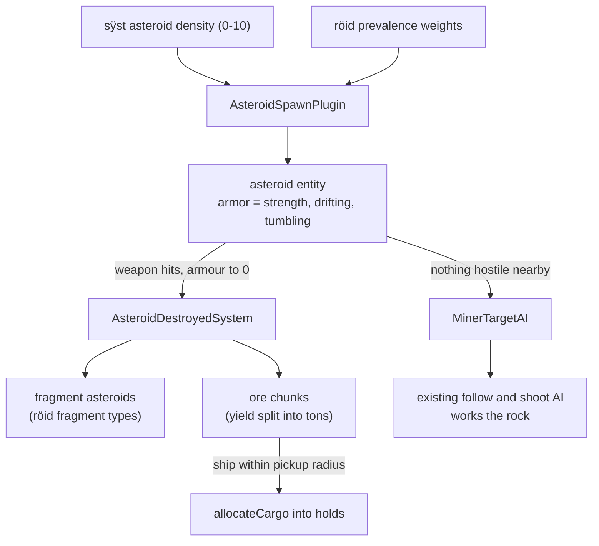

# Asteroids, mining, and the political map

How the asteroid belts and the galaxy map's government shading work, and what
is still missing in both.

## Asteroid data

`röid` resources carry no graphic reference, so retail assigns artwork by
position: röid 128 uses `spïn 800`, and each family of four sizes shares one
"micro" ore sprite starting at `spïn 501`. The resource layout was confirmed
against the retail files with `tools/roid_field_probe.ts`; the decoded colours
read as the materials they name (metal `#73738C`, ice `#EEEEEE`, dust
`#BE844A`), and metal asteroids fragment into smaller metal plus dust.

Yields are commodity indexes below 1000 (`4` is metal) and `jünk` resources
above it. `jünk` is not parsed, so a junk yield is named after the asteroid's
material, which matches how the families read: "Ice Huge" drops ice.

Belt density per system comes from the `sÿst` field at offset 106, a 0-10
value present in 537 of the 545 retail systems.

## Simulation

Belts are server-authoritative, like NPC population, and share the per-system
`asteroid` entity budget.

Asteroids are hittable for free: the collision plugin derives a hitbox hull
from an entity's `AnimationComponent` plus its `CollisionVulnerabilityComponent`,
and the damage system applies armour damage to anything carrying armour. Only
destruction is bespoke, because the ship death path wants a `ShipDataComponent`
and an explosion sequence that a rock has no use for.

Tumbling is applied to the entity's rotation rather than a separate frame
counter, so the drawn sprite frame and the collision hull for that frame stay
in step for free. Mining behaviour is ordered after combat target selection,
so a provoked miner always abandons the rock and fights back.

A mined out belt refills one asteroid at a time on a 20 second timer, so it
cannot be farmed on the spot.

### Still missing

- Ram damage from flying into a rock.
- Asteroid selection with the target key.
- NPC miners storing and selling what they mine.
- Real `jünk` names for ice and crystal yields.

## Political map

Each `gövt` carries the map colour retail uses for that empire: Federation
`#2c2caf`, Auroran `#cf0c0c`, Polaris `#7c1c7c`, Rebellion `#2baa2b`, Pirate
`#3f3f3f`, Vell-os `#c3c310`. The parser used to drop the field.

`territory_field.ts` turns the claimed systems into an RGBA field in galaxy
coordinates, which the starmap uploads as a linearly filtered texture under
the links and markers:

- Each system tints its surroundings with inverse-square weighting, so its own
  colour dominates nearby and hands over near the midpoint between two
  governments. That is what produces a soft boundary instead of two discs.
- Reach is derived from the median nearest-neighbour distance, so dense cores
  do not smear together and a lone system cannot claim half the galaxy.
- Opacity accumulates from overlapping claims, so the inside of a cluster fills
  in solidly while the frontier fades into unclaimed space.
- Near-black government colours are lifted to a minimum brightness, otherwise
  the Wild Geese punch what looks like a hole in the overlay.

Only visited systems contribute, so the overlay cannot reveal unexplored
space, and it is rebuilt when the known-systems set grows.

`tools/territory_preview.ts` renders the field from a running server for
tuning without opening a browser.

### Still missing

- Territory changes driven by mission bits; retail can flip a system's owner
  mid-plot, while this derives from the static `gövt` owner.
- The map's system-info pane.
