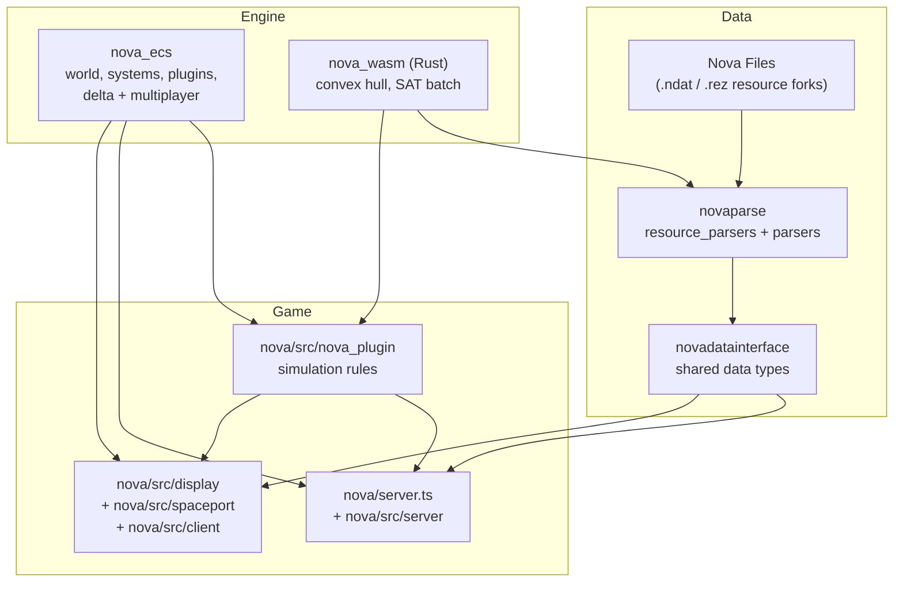
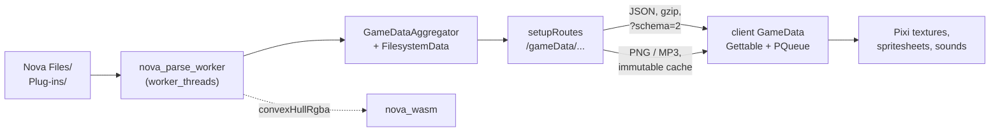
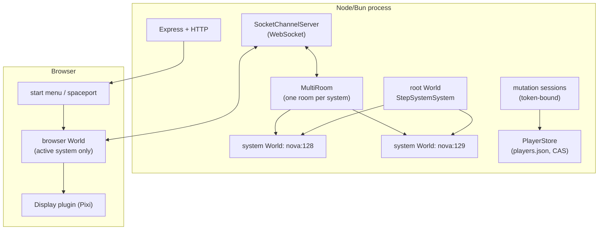
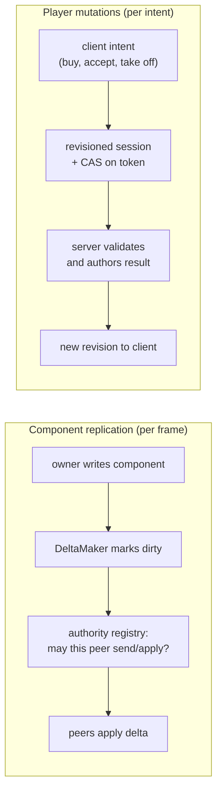
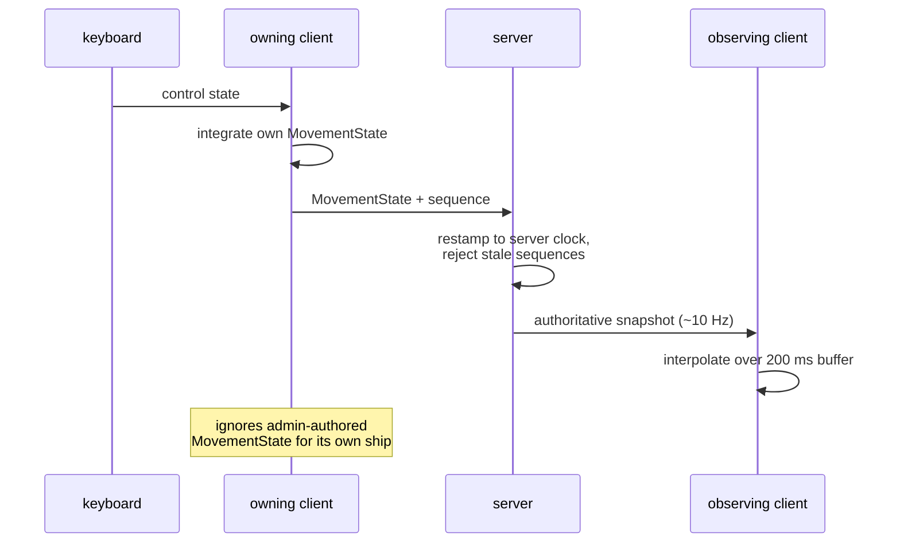
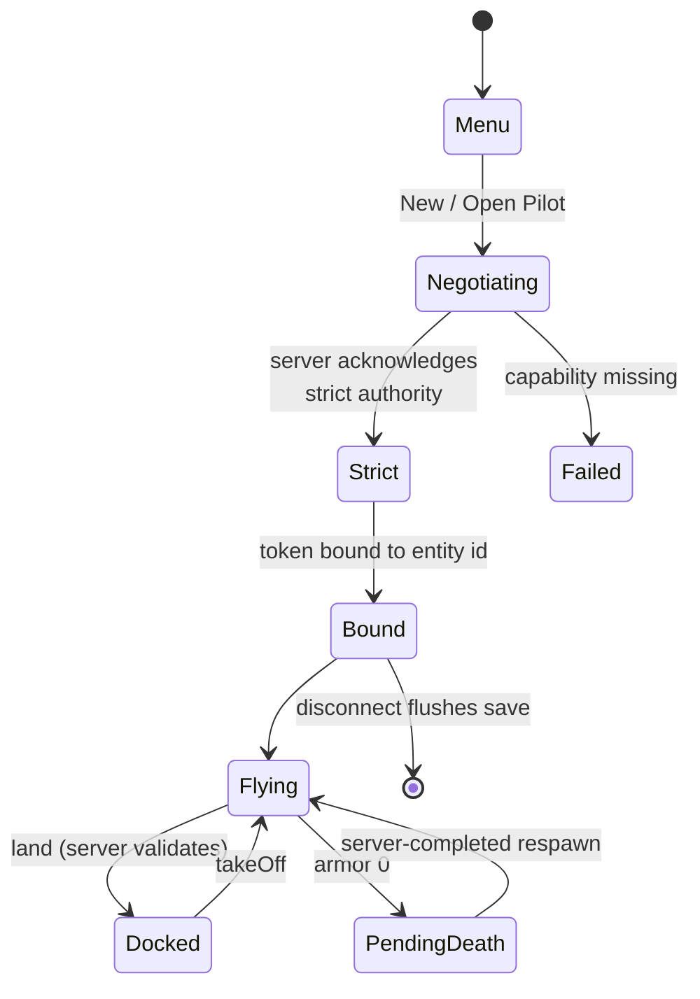
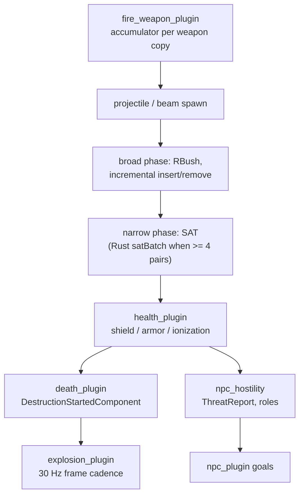
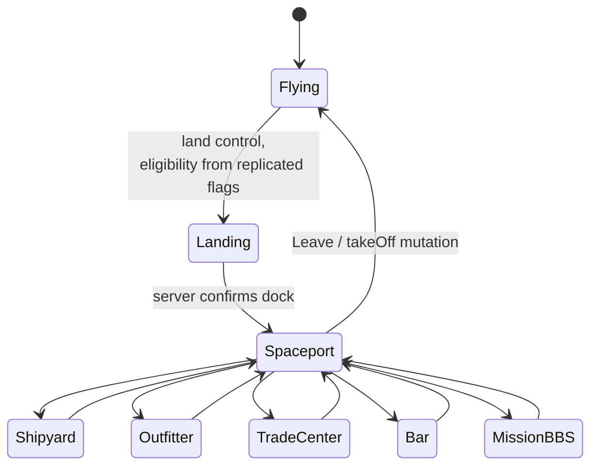
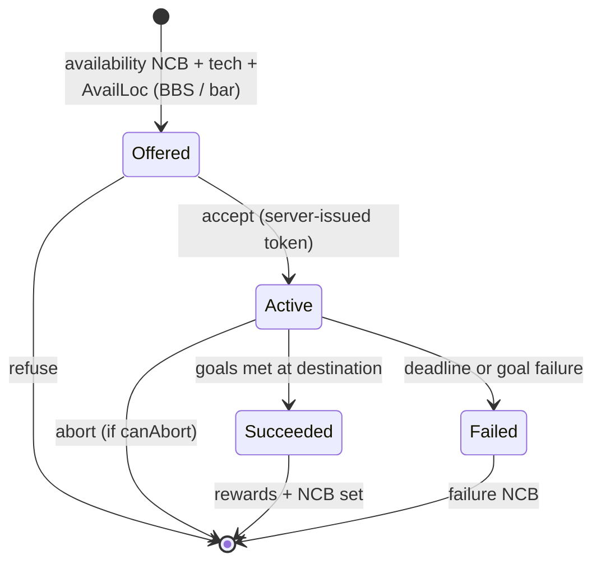
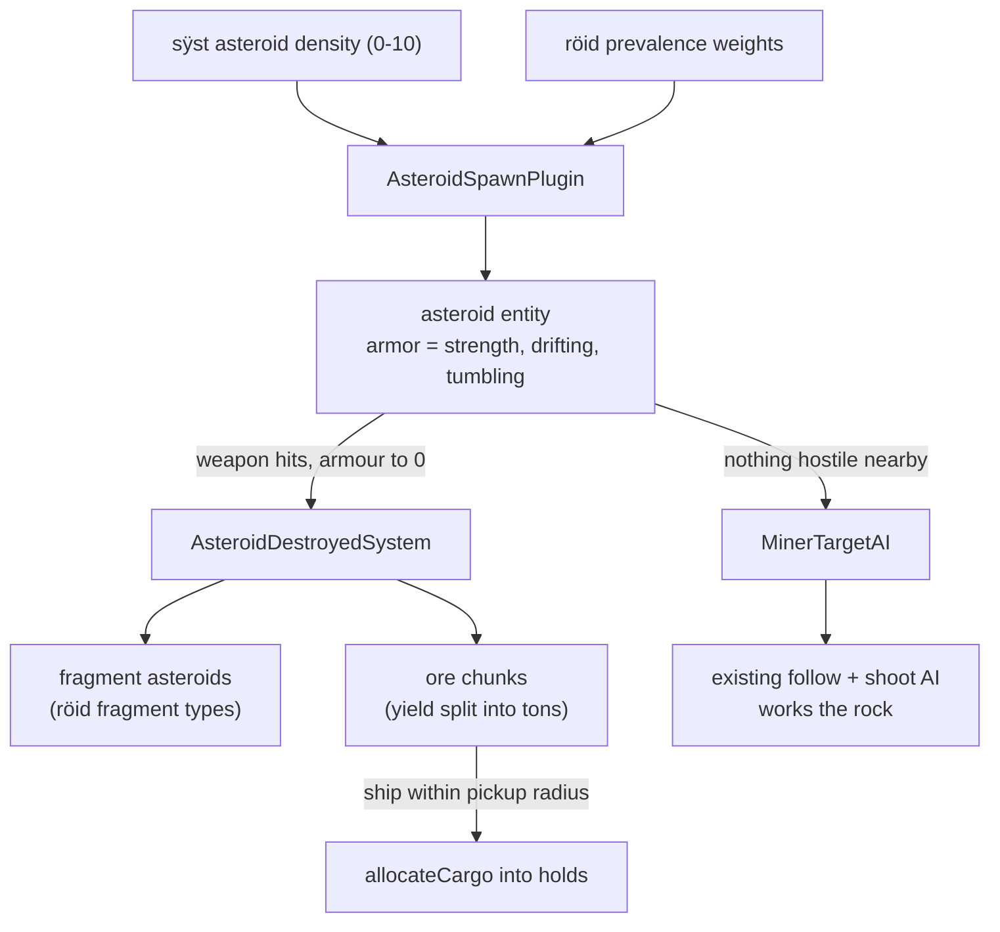

# NovaJS engine overview

A map of how this engine actually works, drawn from the code as of
2026-08-25. It is meant to be read top to bottom: packages, then the data
pipeline, then the runtime, then the individual subsystems that most often
need debugging.

Companion documents:

- `docs/roadmap.md` — canonical work order and completion status.
- `docs/maturity.md` — what is solid, what is thin, what does not exist.
- `docs/architecture-review.md` — maintainability findings.
- `docs/engine-improvements.md` — research on retail engine limitations.

## 1. Packages



`novaparse` never runs in the browser. It runs once in a worker thread on
the server, and the browser sees only its JSON/PNG/MP3 output.

## 2. Data pipeline

Retail resources are converted on the server and served as ordinary web
assets, so the client needs no knowledge of resource forks.



Two details that have caused real bugs:

- JSON metadata is served revalidating and versioned with `?schema=2`;
  binary assets stay immutable. An older scheme cached stale planet JSON for
  a year and broke landing.
- Sprite frames come from one atlas texture per spritesheet, sliced into
  sub-textures, rather than one HTTP request per frame.

## 3. Runtime topology



The root world holds one entity per star system, each carrying a
`SystemComponent` whose value is a nested `World`. Stepping the root world
steps every system world. The browser only ever instantiates the world for
the system the player is in.

## 4. One simulation step

The server runs a fixed 60 Hz timestep with bounded catch-up; the browser
steps on Pixi's ticker with wall-clock deltas clamped to 100 ms so a UI
stall cannot teleport the ship.

```mermaid
sequenceDiagram
    participant Loop as server loop (60 Hz)
    participant World as World.step()
    participant Q as event queue
    participant Sys as systems (topologically sorted)
    participant Delta as DeltaMaker
    participant Net as multiplayer plugin

    Loop->>World: step()
    World->>Q: push StepEvent
    loop until queue drains
        Q->>Sys: run systems subscribed to event
        Sys->>Q: may emit further events
    end
    World->>Delta: collect dirty components
    Delta->>Net: deltas for changed entities only
    Net-->>Loop: send per-peer messages
```

Notes that matter when adding a system:

- Systems declare `args` and `after`/`before`; `topologicalSortList` orders
  them once per `addSystem`, using a DFS sort with cycle diagnostics.
- Events added while flushing are processed in the same step, which is how
  damage, death, and spawn cascades resolve without a frame of latency.
- `DeltaMaker` tracks Immer drafts for objects and compares JSON-safe
  primitives by identity, so a replicated `boolean` component does not
  crash on `createDraft`.

## 5. Replication and authority

Two distinct mechanisms exist, and confusing them is the single most common
source of movement bugs.



Movement specifically:



The owning client is authoritative over its own ship's motion; the server
relays and validates it (a movement envelope shadow gates landing). Remote
ships are *not* simulated locally — they are interpolated, which is why
`RemoteMovementPresentationComponent` must be cleared when ownership moves.

## 6. Player session and strict mutation authority



Every mutation is an intent, queued per token, serialized, applied against
a monotonic revision with compare-and-swap, and persisted as a complete
save unit (pilot state plus ship). Malformed or future-versioned records are
preserved rather than overwritten, and quarantined ship data is replaced by
a materialized default ship rather than making the pilot unplayable.

## 7. Combat pipeline



Behaviors worth remembering:

- Weapon fire uses a shots-owed accumulator, so multiple copies of a weapon
  fire proportionally (the retail "1=X" bug is fixed) and transient
  blockage does not permanently jam a weapon.
- Hull polygons are generated at parse time in Rust and normalized by signed
  area, so a mirrored hull cannot produce a one-sided hitbox.
- Hostility is role-aware: the direct victim always retaliates, only
  military units propagate verified `ThreatReport`s, splash damage never
  starts a cascade, and reports survive the victim's death but expire after
  60 s.

## 8. Landing and spaceport



Service buttons are derived from `spöb` flags (`0x02` commodity, `0x04`
outfitter, `0x08` shipyard, `0x40` bar); the mission computer has no flag
and is offered everywhere. Dialog geometry is taken from the opaque slots
measured in each retail PICT — see `spaceport_layout.ts` and
`mission_bbs_layout.ts`.

## 9. Mission lifecycle



Mission text passes through the retail substitution layer: `{bNNN "a" "b"}`
conditionals first, then the angle tokens (`<DST>`, `<DSY>`, `<CT>`,
`<PAY>`, `<PRK>` and the rest). `<SN>` is intentionally empty in initial
briefings, matching retail.

## 10. Asteroids and mining

Belts are server-authoritative like NPC population. `röid` resources supply
strength, prevalence, yield and fragment types; artwork is assigned by
position (`spïn 800 + index` for the rock, `spïn 501 + family` for the ore),
because the resource itself carries no graphic reference.



Tumbling is applied to the entity's rotation rather than a separate frame
counter, so the drawn sprite frame and the collision hull for that frame stay
in step for free. Mining behaviour is ordered after the combat target
selection, so a provoked miner always abandons the rock and fights back.

## 11. Where to look when something breaks

| Symptom | First file to open |
| --- | --- |
| Ship stutters or snaps back | `nova_ecs/plugins/multiplayer_plugin.ts` |
| Frame time collapses | the system list in `system_plugin.ts`, then `collisions_plugin.ts` |
| Input lost after alt-tab | `nova_ecs/plugins/keyboard_plugin.ts` |
| Save lost or pilot unplayable | `nova/src/server/player_store.ts` |
| "Not available" on a legal action | `nova/src/nova_plugin/server_plugin.ts` sessions |
| Dialog text on top of metal | the layout module for that dialog |
| Missing art or stale data | `setupRoutes.ts` cache headers, `GameData.ts` |
