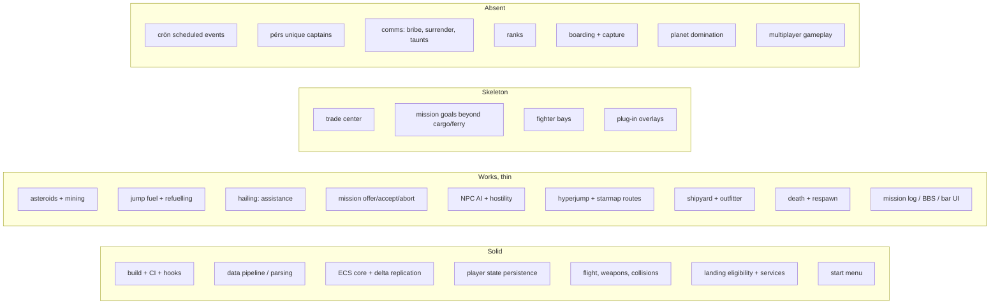

# Maturity map

An honest read of how finished each part of the engine is, as of
2026-08-26. `docs/roadmap.md` says what to do next; this document says how
much to trust what already exists.

Grades:

- **Solid** — implemented, exercised by tests, and playtested.
- **Works, thin** — playable, but shallow relative to retail or lightly
  tested; expect edge cases.
- **Skeleton** — code exists but the retail behavior is largely absent.
- **Absent** — not implemented at all; in several cases the underlying
  retail resource is not even parsed.

## Recovery note, 2026-08-26

A day of uncommitted work was lost when the machine rebooted and cleared
`/tmp`. Most of it was replayed from the agent transcripts, but three areas
could not be reconstructed and are **absent from the code despite what the
rest of this document used to claim**:

- The server-authoritative player mutation wave: token-owned mutation
  sessions, strict mutation authority, and the remote mutation port.
- The versioned player persistence wave built on it: per-token CAS,
  quarantine, and shutdown flushing. **Rebuilt on 2026-08-27**, on the
  existing store rather than on mutation sessions: `schemaVersion` with an
  ordered migration registry, quarantine of unreadable files and records with
  a menu that refuses to overwrite them, signal flushing, a recoverable write
  chain, and saved-ship round trips.
- Atomic NCB effects, and the in-flight pilot dialogs that opened the
  mission log and ship info with a keypress.

Player state still persists through the simpler pre-existing path. Treat
the grades below as describing the current tree, not that lost work.

## Overview

## Not worked on at all

These have no implementation. Where noted, the retail resource is listed in
the raw resource holder but has no parser and no entry in
`novadatainterface`, so the data does not even reach the engine.

| Area | State | Consequence |
| --- | --- | --- |
| `crön` scheduled events | enumerated in `ResourceHolderBase`, no parser, no data type | no galactic clock: no news, no evolving background events, no time-gated story beats |
| `përs` unique captains | enumerated only, no parser, no data type | no named characters, no ship-offered missions (`AvailLoc 2`), no recurring rivals |
| Bribery, surrender, taunts | the hail panel carries only the three buttons that work | cannot buy off an attacker, beg for mercy, or be taunted |
| Ranks | `mission_text` can render `<PRK>`/`<SRK>`, but nothing supplies rank data | every rank token falls back to "captain" |
| `AvailRecord` mission gating | the legal record exists, but mission availability does not read it yet | record-gated missions still offer regardless of standing |
| Ship capture | explicitly refused for `shipGoal` 2 and 5 | capture missions unimplemented; plundering disabled ships now works |
| Planet domination | no state | the dominate-stellar branch of missions is unreachable |
| Escape pods | not modelled | the pilot always dies outright; `gövt` `0x0100` pers-ship behaviour unused |
| Ship `inherentAI` | parsed in `ShipResource`, never reaches `ShipData` | every NPC flies the same pursuit AI regardless of its retail AI type |
| Multiplayer gameplay | deliberately parked | the authority layer exists, the game design does not |

## Legal record and combat rating

Both come from the pilot's own history and use the game's own wording, read
from `STR#` 134 (legal statuses) and `STR#` 138 (combat ratings) rather than
invented strings.

- Every `gövt` now exposes `CrimeTol`, `InitialRecord` and its five crime
  penalties, so each government judges the player by its own standards.
- Shooting a ship charges the government's shooting penalty once per victim;
  destroying it charges the killing penalty and raises the kill count.
- A penalty spreads at one third strength to the victim's allies, and credits
  its enemies the same amount, so hunting pirates improves Federation
  standing.
- Falling past a government's `CrimeTol` makes its ships hunt the player
  permanently, unlike a provocation, which fades.
- The `P` dialog lists the combat rating, kill count, and one line per
  government with an opinion, worst first, marking who is hunting you.

Still missing: `AvailRecord` mission gating, scan fines, smuggling and
boarding penalties (no smuggling or boarding yet), and the two military rungs
at the top of the ladder, which belong to governments the player rules.

## Jump fuel and hailing

Both landed on 2026-08-26.

- The `shïp` field at offset 10 was mislabelled `energy` and fed a physics
  stat nothing read. Every retail value is a multiple of 100 and the Shuttle's
  300 is its three jumps, so it is the fuel tank: it is now parsed as
  `fuelCapacity`.
- A jump spends 100 units. An empty tank refuses the jump with retail's own
  `STR#` 2002 line. Hypergate and mission jumps are free, as in retail.
- The status bar draws one block per jump in the gauge slot the interface
  resource always reserved, bright for whole jumps and dim for a part one.
- **Recharge** on the outfitter buys fuel at 100 credits per jump. Planets
  without an outfitter cannot refuel you, so stranding is real.
- Hailing a ship with the hail key opens a comms panel whose every line comes
  from `STR#` 3000, using retail's blocks of five phrasings. **Request
  Assistance** is the way out of a stranding: allies and well-regarded pilots
  are helped free, strangers may want 500 credits, enemies mock you.

Still missing: the rescuer transfers fuel instantly instead of flying over;
Offer Bribe and Beg For Mercy need bribery and surrender mechanics; the panel
uses `PICT 8508` on inference, since retail's dialog item lists live in the
application's resource fork rather than the data files.

## Needs more love and testing

Ordered roughly by how likely you are to hit it in a normal play session.

**Trade Center — junk goods only.** The screen now uses its own retail frame,
`PICT 8506` (250×285, with a 240×24 title slot and a 241×214 market pane and
no artwork slot, unlike the landing frame it used to borrow), with columns
measured to that geometry and paging. The six standard commodities and their
per-commodity price spread from `spöb` flags are correct. Still missing:
retail's 23 `jünk` goods, which are not parsed at all. Their 676-byte layout
is known — `SoldAt` 8×int16 at 0, `BoughtAt` at 16, `BasePrice` at 32, flags
at 34, `ScanMask` at 36, names at 38 and 102, and the `BuyOn`/`SellOn`
availability expressions at 166 and 421 — but they need a typed parser, game
data exposure, availability-expression evaluation and buy-only/sell-only
offer semantics. No `spöb` change is needed; the locations live in `jünk`.

**Mission goals.** Cargo delivery and ferry work. Escort, defense, "destroy
a specific ship", chained missions, and mid-mission ship/outfit mutations
are partial or missing, so many retail chains cannot progress past their
first leg.

**Mission selectors.** The Bible defines target selection by fixed stellar,
adjacent system, government, ally, enemy, and class mates. Only part of
that is implemented, and a selector resolved at the wrong moment produces
missions pointing at the wrong place.

**Galaxy map.** Nebula artwork and the political overlay are both drawn, the
latter from each system's controlling `gövt` and that government's map
colour, blended into a smooth tessellation and clipped to the systems the
pilot has visited. Not yet reflected: territory changes from mission bits
(retail can flip a system's owner mid-plot) and the map's system-info pane.

**Bar content.** The bar currently shows only mission offers. Retail
also has bar characters and flavour (`PICT 8504` has two panes, unmapped).

**NPC AI — better, still incomplete.** Hostility propagation, combat roles and
retaliation thresholds are tested and behave well. Ships now fly with a shared
velocity-matching approach controller that accounts for turn time, so they
stand off at a distance suited to their weapon range instead of ramming, and
they keep the target under their guns while parked. The retail `inherentAI`
field reaches `ShipData`; its four Bible roles set standoff and decide whether
a hull opens fire unprovoked, so freighters no longer pick fights with their
government's enemies.

Still missing, in rough order of how much they would be felt:

- **Fleeing.** Nothing runs away. The Bible puts this on the government, not
  the hull: `gövt` flag `0x0010` makes warships retreat below 25% shields, and
  its absence means they fight to the death. A wimpy trader should also run
  when attacked, and a brave trader should break off once its attacker is out
  of range.
- **Jumping out.** A warship with no enemies left should leave the system.
- **Interceptor duties.** Retail interceptors park in orbit, buzz ships to scan
  for illegal cargo, and act as piracy police, attacking anyone who fires on or
  tries to board a non-enemy while they watch.
- **Formation flying and deliberate weapon choice.**

Fleet composition, `düde`/`flët` behaviour and long-run population balance in a
busy system are also untested; long fights are where performance problems have
historically appeared.

**Disabling and boarding.** Ships now fall disabled instead of always dying,
losing flight, weapon and jump control while keeping their drift, at the
Bible's thresholds: a third of armour, or a tenth for the 141 warship hulls
carrying `shïp` flag `0x0010`. The governments retail marks with `gövt` flag
`0x1000` fly in, match velocity and plunder cargo and credits, sparing mission
cargo.

A crippled ship's shields come back but its hull does not: armour recharge is
held to the value the disabling blow left, so nothing heals its way free. A
full hull is the signal that somebody repaired the ship, which is what a
respawn provides. Still missing are the two repairs retail offers — the
"repair system" outfit (`oütf` ModType 49, which "will occasionally repair the
ship when it's disabled") and a rescue from a Roadside Assistance government
(`gövt` Flags2 `0x0010`) through the hail panel. A third entitlement remains
unimplemented: `ränk` flag `0x0800`, "Ships allied with the affiliated govt
will always repair or refuel the player for free", since rank resources are
not exposed. (An earlier note here misattributed that to `përs` flag
`0x0800`, which actually means "Make ship leave after accepting its
LinkMission".) The loot is also a
placeholder, a deterministic half-hold plus a small fraction of hull value,
because the real booty table lives in `düde` flags (`0x0001` food through
`0x0020` equipment, `0x0040` money scaled by purchase price) which are not
parsed. Retail's per-ship chance of being disabled rather than destroyed is
deliberately not guessed, disabling and boarding do not yet cost the pilot
legal standing even though `DisabPenalty` and `BoardPenalty` are parsed, and
`gövt` flag `0x0800`, which starts a government's ships out as derelicts, is
not wired up.

**Teardown and GPU lifetime.** Managed graphics fixed the projectile and
explosion leaks, but not every display object is on the managed path.
Repeated jump/land/menu cycles need a soak test with GPU memory watched.

**Asteroids and mining.** Covered in `docs/asteroids-and-territory.md`,
along with the political map overlay.

**Save-format evolution.** Migration, CAS, and quarantine are tested, but
only against the fixtures written so far. Every new persisted field is a
new migration risk, and the legacy flattened projection is still written
for rollback readers.

**Sound.** Music and effects play, but there is no mixing policy, no
distance attenuation, and no per-channel limits, so busy fights get loud
and muddy.

**Plug-in support.** Plug-in files are read, but resource precedence for
missions, `crön`, bar, landing, and text has never been verified against a
real plug-in.

## What is genuinely solid

Worth knowing so you do not re-audit it: the build and check pipeline; the
parse-to-HTTP data path including cache correctness; the ECS core with
primitive-safe deltas and an authority registry; flight, weapon fire,
collision broad/narrow phase, and explosion timing; landing eligibility
from authoritative flags; asteroid belts and mining; and the retail start
menu. Player persistence works, but the hardened version described in the
recovery note above is gone and would have to be rebuilt.

## Suggested order

1. Trade Center layout and retail frame — small, highly visible.
2. Mission goals and selectors — unblocks the actual storylines.
3. `crön` parsing — unlocks news and time-based content, and is a
   prerequisite for a living galaxy.
4. Ranks — cheap state that gates a surprising amount of
   retail content.
5. NPC AI depth — plumb `inherentAI` through and add fleeing and jump-out;
   the cheapest large gain in how alive a fight feels.
6. `përs` unique captains — the biggest remaining "the galaxy feels empty"
   gap, and now that hailing exists they have somewhere to speak.
