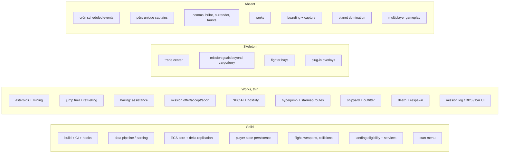

# Maturity map

An honest read of how finished each part of the engine is, as of
2026-08-26. `docs/roadmap.md` says what to do next; this document says how
much to trust what already exists.

Grades:

- **Solid** — implemented, exercised by tests, and playtested.
- **Works, thin** — playable, but shallow relative to retail or lightly
  tested; expect edge cases.
- **Skeleton** — code exists but the retail behavior is largely absent.
- **Absent** — not implemented at all; in several cases the underlying
  retail resource is not even parsed.

## Recovery note, 2026-08-26

A day of uncommitted work was lost when the machine rebooted and cleared
`/tmp`. Most of it was replayed from the agent transcripts, but three areas
could not be reconstructed and are **absent from the code despite what the
rest of this document used to claim**:

- The server-authoritative player mutation wave: token-owned mutation
  sessions, strict mutation authority, and the remote mutation port.
- The versioned player persistence wave built on it: per-token CAS,
  quarantine, and shutdown flushing.
- Atomic NCB effects, and the in-flight pilot dialogs that opened the
  mission log and ship info with a keypress.

Player state still persists through the simpler pre-existing path. Treat
the grades below as describing the current tree, not that lost work.

## Overview

## Not worked on at all

These have no implementation. Where noted, the retail resource is listed in
the raw resource holder but has no parser and no entry in
`novadatainterface`, so the data does not even reach the engine.

| Area | State | Consequence |
| --- | --- | --- |
| `crön` scheduled events | enumerated in `ResourceHolderBase`, no parser, no data type | no galactic clock: no news, no evolving background events, no time-gated story beats |
| `përs` unique captains | enumerated only, no parser, no data type | no named characters, no ship-offered missions (`AvailLoc 2`), no recurring rivals |
| Bribery, surrender, taunts | the hail panel carries only the three buttons that work | cannot buy off an attacker, beg for mercy, or be taunted |
| Ranks | `mission_text` can render `<PRK>`/`<SRK>`, but nothing supplies rank data | every rank token falls back to "captain" |
| `AvailRecord` mission gating | the legal record exists, but mission availability does not read it yet | record-gated missions still offer regardless of standing |
| Boarding and capture | explicitly refused for `shipGoal` 2 and 5 | plunder and ship capture missions are unacceptable by design |
| Planet domination | no state | the dominate-stellar branch of missions is unreachable |
| Escape pods / disabled-ship lifecycle | not modelled | ships die instead of being disabled and looted |
| Ship `inherentAI` | parsed in `ShipResource`, never reaches `ShipData` | every NPC flies the same pursuit AI regardless of its retail AI type |
| Multiplayer gameplay | deliberately parked | the authority layer exists, the game design does not |

## Legal record and combat rating

Both come from the pilot's own history and use the game's own wording, read
from `STR#` 134 (legal statuses) and `STR#` 138 (combat ratings) rather than
invented strings.

- Every `gövt` now exposes `CrimeTol`, `InitialRecord` and its five crime
  penalties, so each government judges the player by its own standards.
- Shooting a ship charges the government's shooting penalty once per victim;
  destroying it charges the killing penalty and raises the kill count.
- A penalty spreads at one third strength to the victim's allies, and credits
  its enemies the same amount, so hunting pirates improves Federation
  standing.
- Falling past a government's `CrimeTol` makes its ships hunt the player
  permanently, unlike a provocation, which fades.
- The `P` dialog lists the combat rating, kill count, and one line per
  government with an opinion, worst first, marking who is hunting you.

Still missing: `AvailRecord` mission gating, scan fines, smuggling and
boarding penalties (no smuggling or boarding yet), and the two military rungs
at the top of the ladder, which belong to governments the player rules.

## Jump fuel and hailing

Both landed on 2026-08-26.

- The `shïp` field at offset 10 was mislabelled `energy` and fed a physics
  stat nothing read. Every retail value is a multiple of 100 and the Shuttle's
  300 is its three jumps, so it is the fuel tank: it is now parsed as
  `fuelCapacity`.
- A jump spends 100 units. An empty tank refuses the jump with retail's own
  `STR#` 2002 line. Hypergate and mission jumps are free, as in retail.
- The status bar draws one block per jump in the gauge slot the interface
  resource always reserved, bright for whole jumps and dim for a part one.
- **Recharge** on the outfitter buys fuel at 100 credits per jump. Planets
  without an outfitter cannot refuel you, so stranding is real.
- Hailing a ship with the hail key opens a comms panel whose every line comes
  from `STR#` 3000, using retail's blocks of five phrasings. **Request
  Assistance** is the way out of a stranding: allies and well-regarded pilots
  are helped free, strangers may want 500 credits, enemies mock you.

Still missing: the rescuer transfers fuel instantly instead of flying over;
Offer Bribe and Beg For Mercy need bribery and surrender mechanics; the panel
uses `PICT 8508` on inference, since retail's dialog item lists live in the
application's resource fork rather than the data files.

## Needs more love and testing

Ordered roughly by how likely you are to hit it in a normal play session.

**Trade Center — worst offender.** It reuses `PICT 8500`, the *landing*
frame, and writes its list at y=-175, which lands inside the artwork slot.
That is why it reads as broken. It also trades only the six standard
commodities with no retail `junk` goods, and price levels come from
`spöb` flags without the retail per-commodity price spread. Needs its own
retail frame identified (candidate: `PICT 8506`) plus a layout pass.

**Mission goals.** Cargo delivery and ferry work. Escort, defense, "destroy
a specific ship", chained missions, and mid-mission ship/outfit mutations
are partial or missing, so many retail chains cannot progress past their
first leg.

**Mission selectors.** The Bible defines target selection by fixed stellar,
adjacent system, government, ally, enemy, and class mates. Only part of
that is implemented, and a selector resolved at the wrong moment produces
missions pointing at the wrong place.

**Galaxy map.** Nebula artwork and the political overlay are both drawn, the
latter from each system's controlling `gövt` and that government's map
colour, blended into a smooth tessellation and clipped to the systems the
pilot has visited. Not yet reflected: territory changes from mission bits
(retail can flip a system's owner mid-plot) and the map's system-info pane.

**Bar content.** The bar currently shows only mission offers. Retail
also has bar characters and flavour (`PICT 8504` has two panes, unmapped).

**NPC AI — thinner than it looks.** Hostility propagation, combat roles and
retaliation thresholds are tested and behave well, but the flying itself is
one behaviour: turn towards the target, hold full throttle, fire every weapon
in range. Nothing flees when crippled, jumps out, keeps its distance to suit
its weapon range, flies in formation, or picks a weapon deliberately. Miners
are the sole exception, standing off their rock. The retail `inherentAI` field
that would distinguish a wandering trader from an interceptor is parsed but
never reaches `ShipData`. Fleet composition, `düde`/`flët` behaviour and
long-run population balance in a busy system are also untested; long fights
are where performance problems have historically appeared.

**Teardown and GPU lifetime.** Managed graphics fixed the projectile and
explosion leaks, but not every display object is on the managed path.
Repeated jump/land/menu cycles need a soak test with GPU memory watched.

**Asteroids and mining.** Covered in `docs/asteroids-and-territory.md`,
along with the political map overlay.

**Save-format evolution.** Migration, CAS, and quarantine are tested, but
only against the fixtures written so far. Every new persisted field is a
new migration risk, and the legacy flattened projection is still written
for rollback readers.

**Sound.** Music and effects play, but there is no mixing policy, no
distance attenuation, and no per-channel limits, so busy fights get loud
and muddy.

**Plug-in support.** Plug-in files are read, but resource precedence for
missions, `crön`, bar, landing, and text has never been verified against a
real plug-in.

## What is genuinely solid

Worth knowing so you do not re-audit it: the build and check pipeline; the
parse-to-HTTP data path including cache correctness; the ECS core with
primitive-safe deltas and an authority registry; flight, weapon fire,
collision broad/narrow phase, and explosion timing; landing eligibility
from authoritative flags; asteroid belts and mining; and the retail start
menu. Player persistence works, but the hardened version described in the
recovery note above is gone and would have to be rebuilt.

## Suggested order

1. Trade Center layout and retail frame — small, highly visible.
2. Mission goals and selectors — unblocks the actual storylines.
3. `crön` parsing — unlocks news and time-based content, and is a
   prerequisite for a living galaxy.
4. Ranks — cheap state that gates a surprising amount of
   retail content.
5. NPC AI depth — plumb `inherentAI` through and add fleeing and jump-out;
   the cheapest large gain in how alive a fight feels.
6. `përs` unique captains — the biggest remaining "the galaxy feels empty"
   gap, and now that hailing exists they have somewhere to speak.
